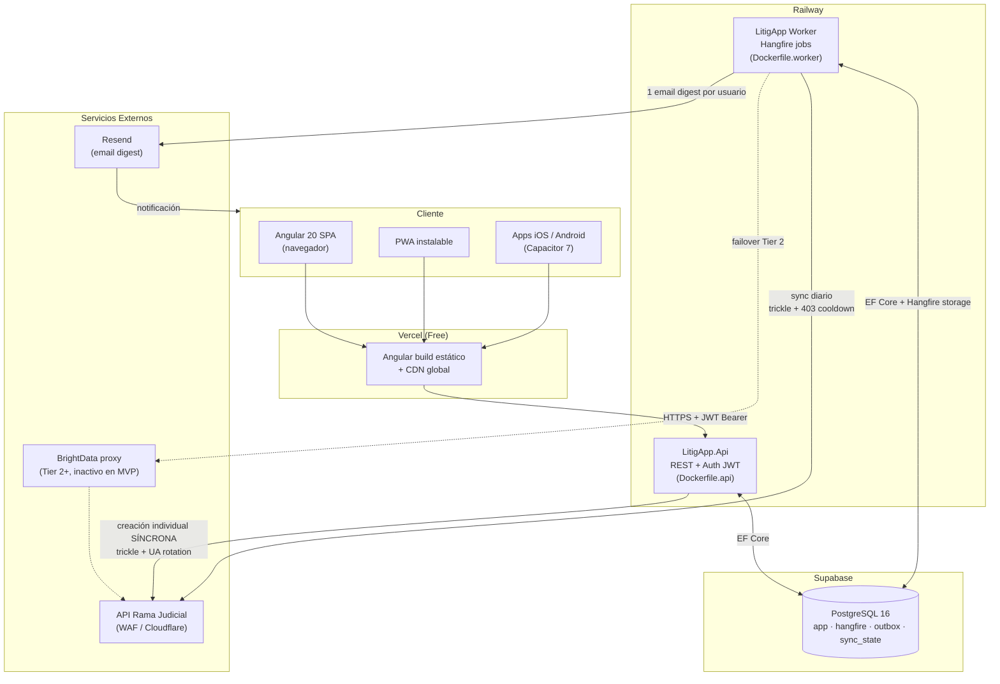
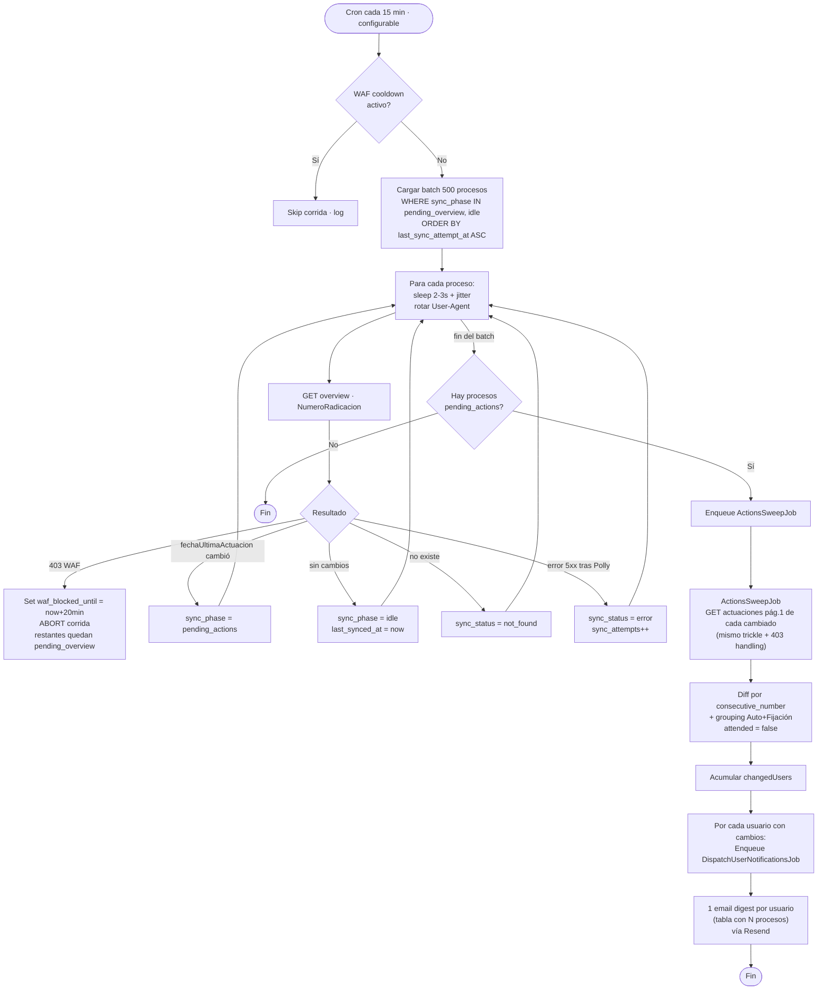
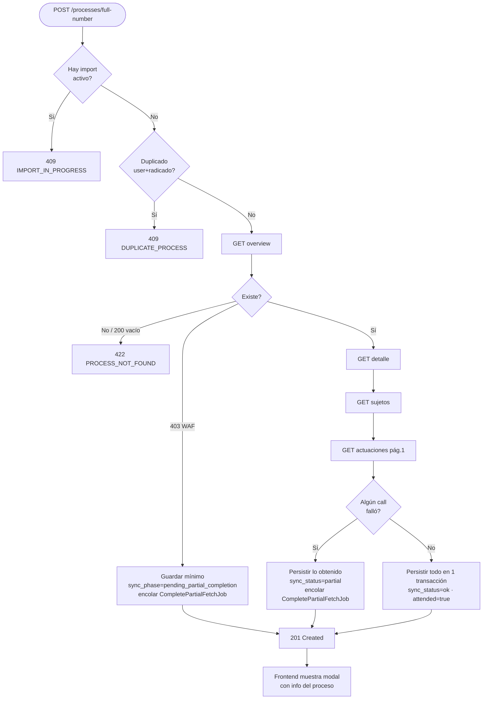
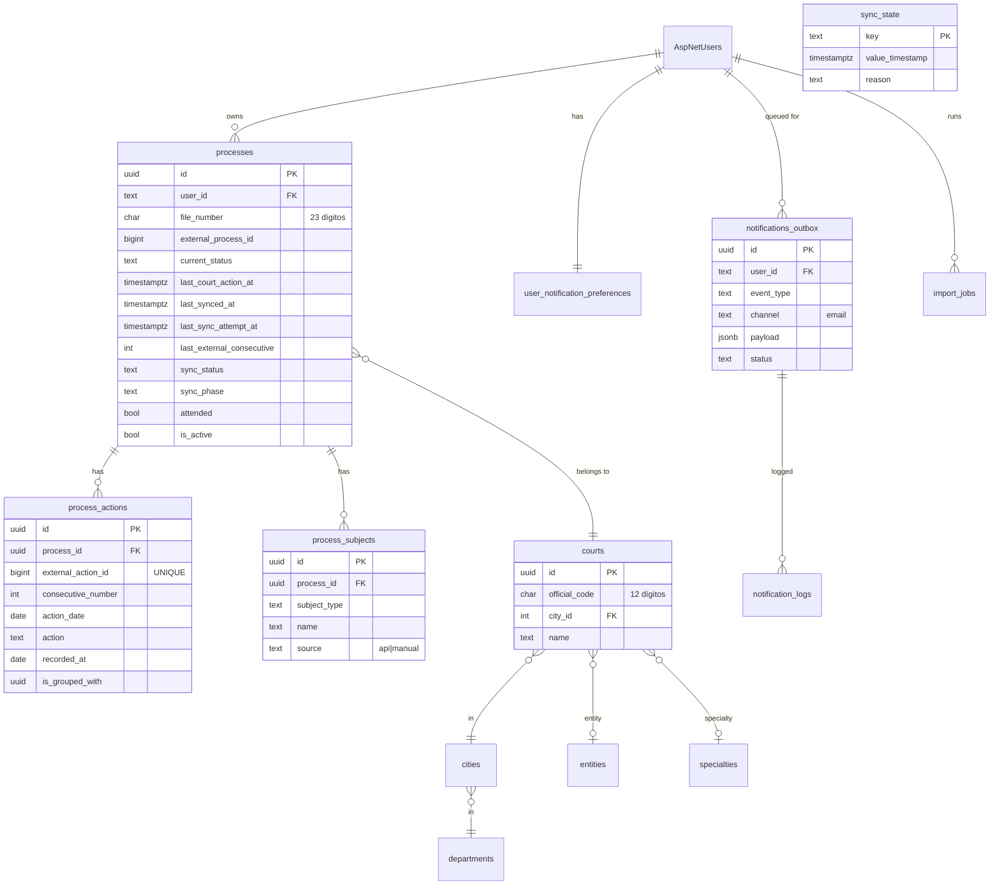
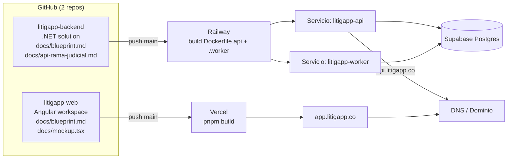

# LitigApp — Diagramas de Arquitectura

> Formato Mermaid. Cómo usarlos:
> - **mermaid.live**: pega el bloque (sin los ```) en https://mermaid.live → exporta PNG/SVG.
> - **draw.io**: Arrange → Insert → Advanced → Mermaid → pega el código.
> - **Notion / GitHub / Obsidian**: renderizan Mermaid nativo en bloques ```mermaid.

---

## 1. Arquitectura de Sistema (vista de despliegue)



---

## 2. Sync Engine WAF-resilient (flujo del job diario)



---

## 3. Flujo de creación individual de proceso (SÍNCRONO)



---

## 4. Modelo de datos (entidades principales)



---

## 5. Topología de repos y despliegue


